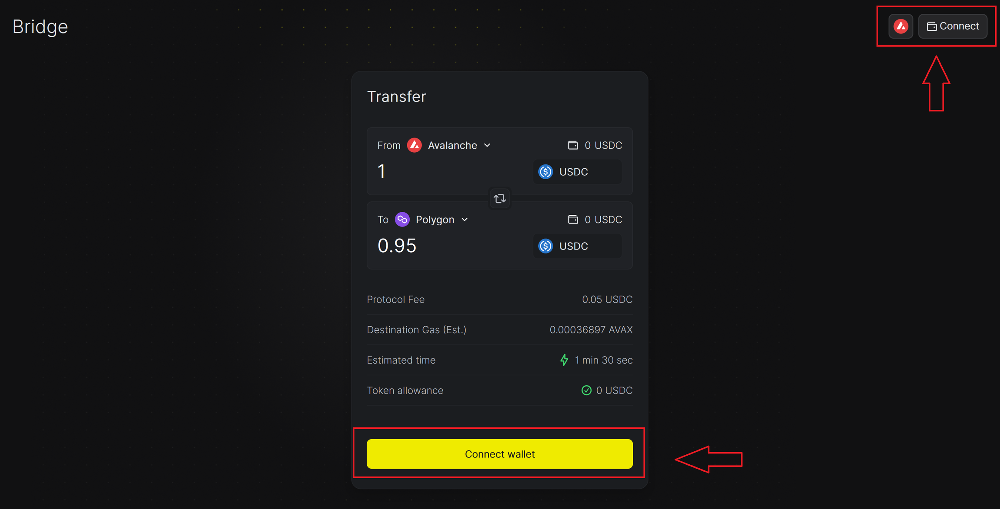

# Bridge

Emmet.Finance offers an advanced mechanism for swift cross-chain transfers, supporting a diverse array of tokens and blockchains, including but not limited to Ethereum, Avalanche, Arbitrum, Base, Polygon, and Optimism. This innovative approach allows for the quick and secure transfer of assets without relying on idle liquidity pools, streamlining the process for users.

How to Use the EmmetBridge for Cross-Chain Transfers:
Step 1: For personal transfers across networks, ensure you've set up wallets for each blockchain involved. If you're sending assets to someone else, verify that the recipient's wallet is active (i.e., has a minimal balance).

Step 2: Navigate to https://emmet.finance/bridge and connect your wallet to the platform.

