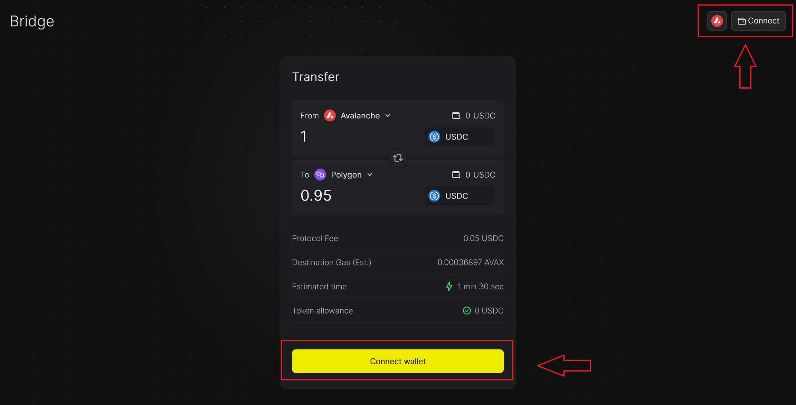
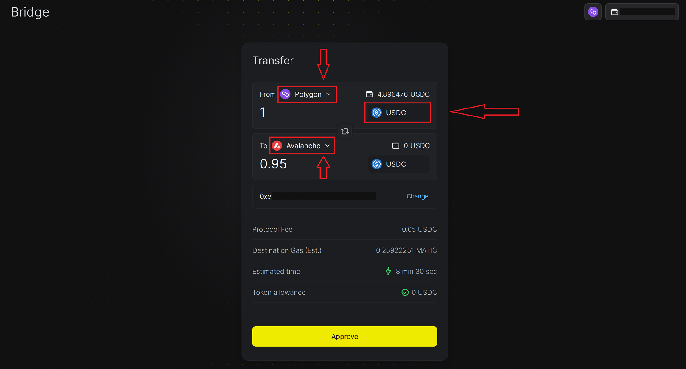
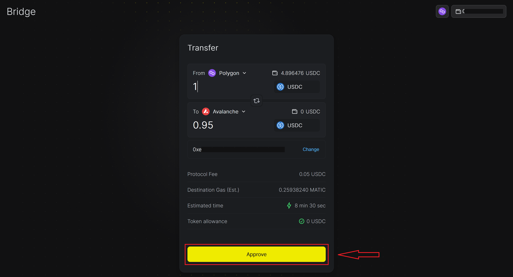
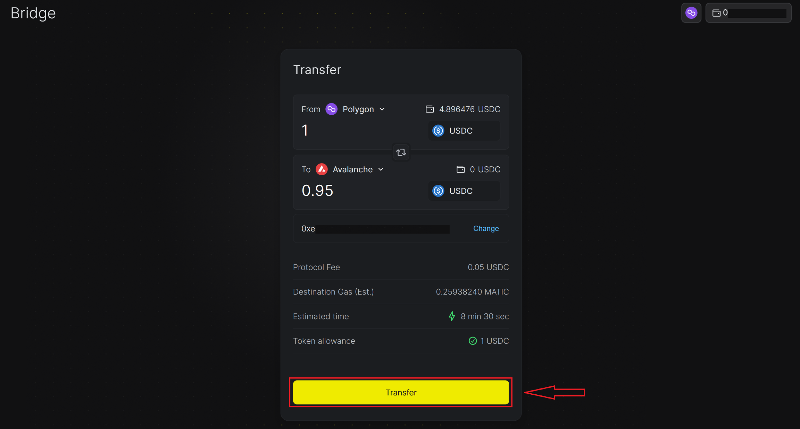
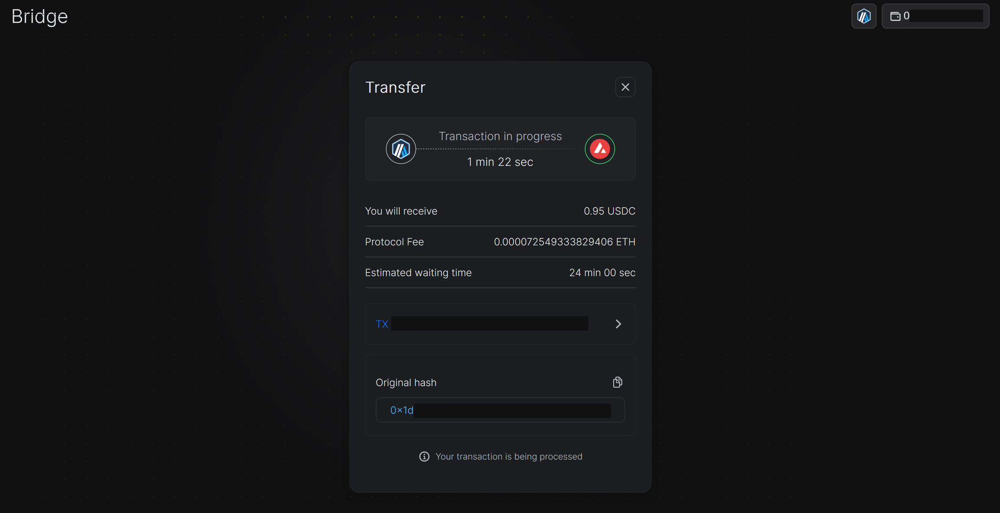

# Bridge

Emmet.Finance offers an advanced mechanism for swift cross-chain transfers, supporting a diverse array of tokens and blockchains, including but not limited to Ethereum, Avalanche, Arbitrum, Base, Polygon, and Optimism. This innovative approach allows for the quick and secure transfer of assets without relying on idle liquidity pools, streamlining the process for users.

## How to Use the EmmetBridge for Cross-Chain Transfers:

For personal transfers across networks, ensure you've set up wallets for each blockchain involved. If you're sending assets to someone else, verify that the recipient's wallet is active (i.e., has a minimal balance).

### Step 1 - Conect your wallet

Navigate to [https://emmet.finance/bridge](https://emmet.finance/bridge) and connect your wallet to the platform.

### Step 2 - Set the parameters

To initiate a transfer, select the token you wish to send from the drop-down menu. Choose your source and destination networks from the available options (Note: Additional networks and tokens will be supported in the future). Enter the recipient's address and the amount you want to transfer.

### Step 3 - Approve

If the allowance for the token you're transferring is below the desired amount, click the "Approve" button to authorize the transaction. It's recommended for security reasons not to set the allowance much higher than the transfer amount.

### Step 4 - Transfer

Once the allowance meets or exceeds the transfer amount, click the "Transfer" button and confirm the transaction through your wallet extension (e.g., Metamask or others via WalletConnect).

### Step 5 - Await completion

Await the completion of your cross-chain transaction. You can monitor the progress through stages labeled "Process" and "Success". Successful bridge transactions appearing in the UI indicate validators have processed your transaction. During peak times, transactions might take longer than usual. If there's a significant delay, reach out to support with your transaction link from the sender chain's explorer for assistance.

[Emmet.Finance](https://emmet.finance/) is dedicated to providing a smooth and efficient cross-chain transfer experience, allowing for the movement of various tokens across multiple blockchains without the need for idle liquidity pools.