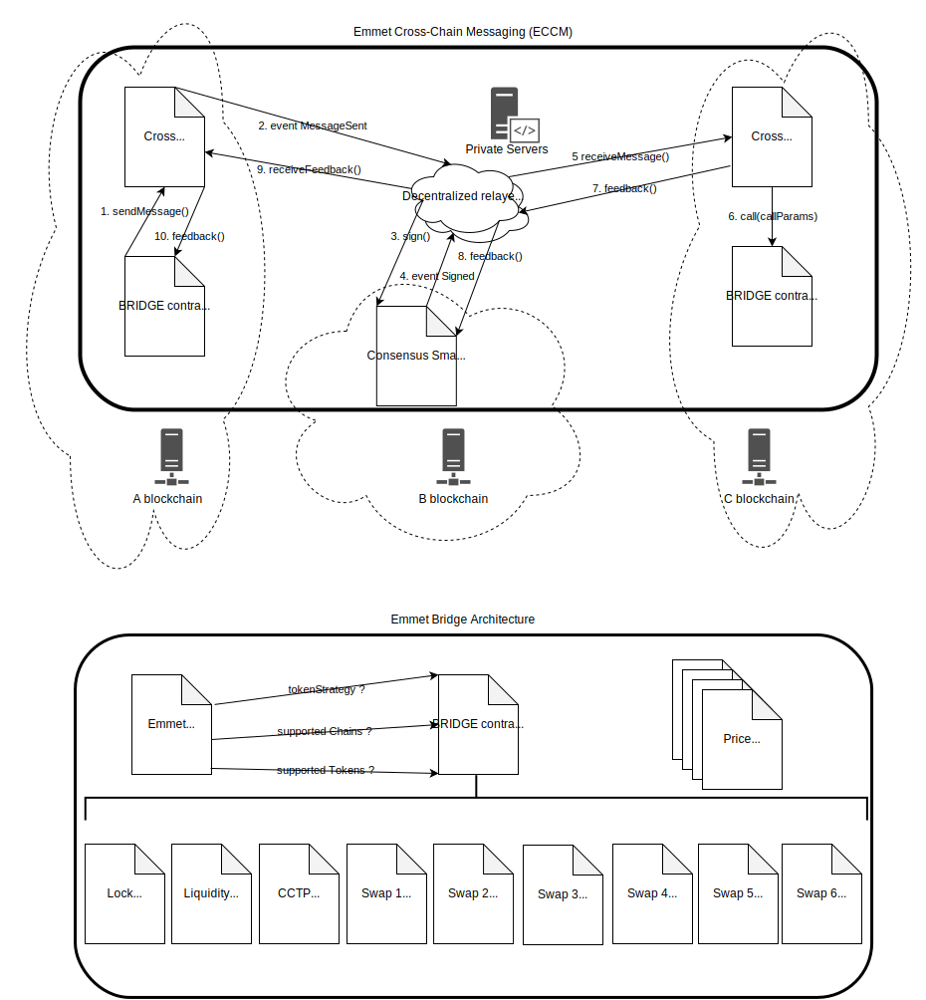

# Emmet Cross-Chain Messaging (ECCM)

The `Emmet.Finance Cross-Chain Messaging` system is designed to enable decentralized, secure, and reliable communication between EVM and non-EVM chains. This system addresses the growing demand for interoperability across diverse blockchain networks, providing an innovative solution that ensures both functionality and security.

## Key Features

1. **Decentralized Cross-Chain Communication**: Facilitates the transfer of messages and data between different blockchain environments, allowing for interaction between EVM-based chains and non-EVM chains.

2. **Secure Feedback Mechanism**: The system includes a feedback loop from the receiving chain contracts, which confirms whether the cross-chain transaction succeeded or failed. This feedback allows for the reversal of transactions on the originating chain if necessary, ensuring data integrity and reducing risk.

3. **Transparent Consensus**: Unlike many competitors who rely on centralized, opaque Web2 infrastructure to achieve consensus, Emmet’s system leverages a transparent smart contract-based consensus mechanism. Cross-chain relayers collect a Byzantine Fault Tolerance (BFT) multi-signature within the smart contract, providing a fully on-chain, verifiable process.

4. **Smart Contract-Based Consensus**: The use of a smart contract for multi-signature verification makes the consensus process open and auditable, eliminating the need for trust in any centralized entity or external server.

## Advantages

1. **Security and Reliability**: With on-chain feedback and the ability to revert transactions, Emmet ensures that users can trust the integrity of their cross-chain interactions.

2. **Decentralization**: Emmet’s transparent, contract-driven BFT multi-signature approach differentiates it from competitors, where the consensus process remains hidden in centralized Web2 servers.

3. **EVM & Non-EVM Interoperability**: Seamlessly connects diverse blockchain ecosystems, fostering a broader decentralized finance (DeFi) landscape.

The Emmet Cross-Chain Messaging system offers a secure, decentralized, and transparent solution for cross-chain communication, pushing the boundaries of blockchain interoperability.